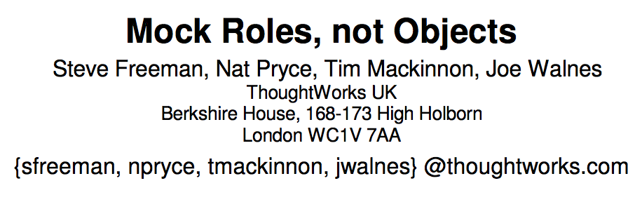

build-lists: true

# [fit] おはよおう ございます
# [fit] Good morning!

---


# Real World Mocking In Swift

---
# [fit] You Want To Write Tests
---
# [fit] But You Don’t Want Them 

# [fit] To Mess Up Your 

# [fit] Real Stuff

---

# [fit] Or Be Slow
---
```swift
let session = NSURLSession()
let url = NSURL(string: "http://www.tryswiftconf.com")!
let task = session.dataTaskWithURL(url) { (data, _, _) -> Void in
    if let data = data {
        let string = String(data: data, encoding: NSUTF8StringEncoding)
        print(string)
    }
}
task.resume()
```

^ here’s a simple example of a NSURLSession  you might have in your codebase. if you make a real request your test will be slow. also asynchronous tests are not reliable. the more tests you have the higher the likelihood one or more will fail randomly.  but how do you test this without making a real request?

^ from: http://masilotti.com/testing-nsurlsession-input/

---

# OCMock can't save you now


^ Technically you can use OCMock with Swift but only with restrictions and funcionality is still limited, so there is no point in trying to use it. 

^ Mocking frameworks are all built on top of reflection, taking advantage of being able to change classes, types and objects at runtime. Swift is currently read-only so there’s no way to modify your program at runtime. it doesn’t seem like it’ll change since it’s part of what makes swift such a safe programming language. We'll see at the end that Swift does have some mocking frameworks currently but they are different than what you'd find in languages with more access to the language runtime. 
http://blog.pragmaticengineer.com/swift-the-only-modern-language-with-no-mocking-framework/

^as a result we’ll need to write our own mocks.

---

```swift
class HTTPClientTests: XCTestCase {
    var subject: HTTPClient!
    let session = MockURLSession()

    override func setUp() {
        super.setUp()
        subject = HTTPClient(session: session)
    }
```
^We first create a mock URL session and inject it.

---

```swift
class HTTPClientTests: XCTestCase {
    var subject: HTTPClient!
    let session = MockURLSession()

    override func setUp() {
        super.setUp()
        subject = HTTPClient(session: session)
    }
    
    func test_GET_RequestsTheURL() {
        let url = NSURL(string: "http://www.tryswiftconf.com")!

        subject.get(url) { (_, _) -> Void in }
```

^ Then we call, get(), with a referenced URL. 

---

```swift
class HTTPClientTests: XCTestCase {
    var subject: HTTPClient!
    let session = MockURLSession()

    override func setUp() {
        super.setUp()
        subject = HTTPClient(session: session)
    }
    
    func test_GET_RequestsTheURL() {
        let url = NSURL(string: "http://www.tryswiftconf.com")!

        subject.get(url) { (_, _) -> Void in }

        XCTAssert(session.lastURL === url)
    }
}
```

^ Finally, we assert that the URL the session received was the same one we passed in.

^from: http://masilotti.com/testing-nsurlsession-input/

---


^ some hard truths 

---
# [fit] It Will Take A Lot Of  

# [fit] Time

^ It will take a lot of time. writing your own mocks will definitely take more time than having ocmock create them for you. but i will show you ways to make this take less time. 

---
# [fit] You Will Wonder If It’s 

# [fit] Worth It

^ You will wonder if it's worth it. 

---


^ for every mock you write you have to think about whether avoiding using the real type is worth the time you will spend writing, integrating and maintaining a mock. i will show you how to think about this tradeoff and only write mocks that are worth the investment. 

---
# [fit] Why Use Mocks

- Make tests faster (like 1000s of times faster!) :bullettrain_side:
- Increase coverage of test suite :earth_americas:
- Make tests more robust :muscle:

^ Make tests faster - Web servers, databases, and services over the network run thousands of times slower than computer instructions; slowing down the tests. slow tests don’t get run as often and are thus not as useful.

^ Increase coverage of test suite - Error conditions and exceptions are nearly impossible to test without mocks that can simulate them. Functions that perform dangerous tasks, such as deleting files, or deleting database tables, are difficult to safely test without mocks.

^ Make tests more robust - 
Without mocks, The tests are sensitive to faults in parts of the system that are not related to what is being tested.
Network timings can be thrown off by an unexpected computer load. 
Databases may contain extra or missing rows.
Configuration files may have been modified. 

^ This is from a blog post from Uncle Bob, who is the co-author of the Agile Manifesto. 

^ https://blog.8thlight.com/uncle-bob/2014/05/10/WhenToMock.html
 
---
# [fit] Testing

^ i know that testing is not as common in iOS development. but there are lots of great reasons to do it and do it now

---


^ the book The Effective Engineer by Edmond Lau had a huge effect on me. it convinced me that adding tests was one of the highest leverage improvements i could make to our codebase. 

^ some reasons why:

^ it allows  engineers to make changes, especially large refactorings, with significantly higher confidence. i know if i want to rethink how we do networking, try out ReactiveCocoa or improve our utilities for concurrency i want to have tests in place so i know i don’t break anything. if you want to improve your application, testing is the first place you should look. 

^ it decreases bugs and the repetitive work of manual testing.

^ when code does break, automated tests help to efficiently identify who’s accountable

^ tests also offer executable documentation of what cases the original author considered and how to invoke the code

---


# [fit] The Time 

# [fit] To Write Tests Is

^ the time to write tests is

---

# [fit] Now

^ now 

---


^ writing tests is done more easily by the original authors when their code is fresh in their minds

---


^ rather than by those who try to modify it months or years later

^ fostering a culture of testing on a team will take time and effort. it’s best to start the process now. 

---

# [fit] Dependency 

# [fit] Injection

^ one technique we'll use in our tests is dependency injection 

---


```swift
class VideoCaptureManager: NSObject {
    var userDefaults: UserDefaultsProtocol

    //MARK: - Initializers
    override init() {
        self.userDefaults = UserDefaults()
    }

    convenience init(userDefaults: UserDefaultsProtocol) {
        self.init()
        self.userDefaults = userDefaults
    }
}
```
^ here we use multiple constructor injection with a default constructor. the default constructor is a convenient way to initialize a type with all real dependencies without needing to pass in any arguments. 

^ this is considered a bad practice by Java programmers and has the title "bastard injection." however, that is mostly because it causes issues when you use a Dependency Injection container, either when rolling your own or through a framework like Typhoon or Swinject. if you aren't doing that then it's not actually a bad practice. 

---

> Dependency injection means giving an object its instance variables. Really. That's it.
-- James Shore

^ "Dependency Injection" is a 25-dollar term for a 5-cent concept.
Dependency injection means giving an object its instance variables.
Really. 
That's it.
http://www.jamesshore.com/Blog/Dependency-Injection-Demystified.html

---
# [fit] Why Not Just Use A 

# [fit] Singleton?

^ you might wonder, why not just use a singleton?

---

```swift
class VideoUploadManager {
    static let sharedInstance = VideoUploadManager()
}

class TimeMachineAPI {
    func uploadVideo(videoRecording: VideoRecording) {
        VideoUploadManager.sharedInstance.upload(videoRecording: self.videoRecording, completion: { (error) -> Void in
            if let error = error {
                Log.error(error.localizedDescription)
            }
        })
    }
}
```

^ this is the one line singleton for a VideoUploadManager. It is then used in the TimeMachineAPI to upload a video. 

---

# [fit] Why Use Dependency Injection 
- Easy customization :art:
- Clear ownership :closed_lock_with_key:
- Testability :heart_eyes:

^ we have three great reasons to use dependency injection

^ Easy customization - When creating an object, it’s easy to customize parts of it for specific scenarios instead of using the same singleton everywhere 

^ Clear ownership  - Particularly when using constructor injection, the object ownership rules are strictly enforced—helping to avoid circular dependencies 

^ Testability - also, no hidden dependencies need to be managed. it becomes simple to mock out the dependencies to focus our tests on the object being tested.

^ This is from a post on Square’s engineering blog on why we should use dependency injection
https://corner.squareup.com/2015/06/dependency-injection-in-objc.html

---
# [fit] Constructor injection

^ there are several main forms of dependency injection, but constructor injection is generally preferred because it makes dependencies explicit. i will be using constructor injection in all my examples. 

^ there’s a good article about this on objc.io 
https://www.objc.io/issues/15-testing/dependency-injection/

---
# [fit] Test Doubles

^ using dependency injection we can pass in test doubles instead of the real objects. 

---
# [fit] Types of Test Doubles  
- Stubs :grinning:
- Mocks :confused:
- Partial mocks :anguished:

^ OCMock made it easy to stubs, mocks and partial mocks. 

^ In looking at many resources on testing I found the definitions used for these terms was consistent within iOS and also consistent with java. This is important because java is where we find some of most authoritative resources on the topic and where mocks were originally developed. 

---
# [fit] Stubs
---
> Fakes a response to method calls of an object
-- Unit Testing Tutorial: Mocking Objects

---
```swift
class StubTimeMachineAPI: TimeMachineAPI {
    var videoUrl = "https://www.youtube.com/watch?v=SQ8aRKG9660"

    func getVideoFor(year: Int) -> String {
        return videoUrl
    }
}
```

^ some of the most common stubs are for APIs. they give you fake responses instead of hitting the real API. this is also useful when you’re relying on an API that hasn’t been built yet 

^ we’re going to indulge in some Sci-Fi APIs. 

^ The API call to TimeMachineAPI would make the time machine go to the provided year, take a short video of what it sees and upload it to youtube when it gets back to the present. the stub API call will return a hardcoded video URL instead of actually calling the API. 

---
# [fit] Mocks

^ are a little more complex 

---
> Let you check if a method call is performed or if a property is set
-- Unit Testing Tutorial: Mocking Objects

---

```swift
class MockTimeMachine: TimeMachine {
    var timeTravelWasCalled = false

    mutating func timeTravelTo(year: Int) {
        timeTravelWasCalled = true
    }
}
```

^ This TimeMachine allows you to travel to any year you want.
our mock time machine has a variable timeTravelWasCalled. when we call timeTimeTravelTo, timeTravelWasCalled is set to true. this allows us to test that the function we want to get called actually gets called. 

---
# [fit] Partial 

# [fit] Mock

---
> Any actual object which has been wrapped or changed 
-- Justin Searls

---

> to provide artificial responses to some methods but not others
-- Justin Searls

---


# [fit] Partial Mocks Are An 

# [fit] Anti-pattern

^ i will not encourage you to use them nor will i go into detail on how you can create and use them in your swift apps
 
---
# [fit] What’s Wrong With Partial Mocks?  
- Challenging to set up :tired_face:
- Decreases the comprehensibility of the test :no_mouth:

^ they require instantiating a real thing, then altering or wrapping it, then providing it

---
# [fit] What’s Real? 

# [fit] What’s Fake? 

^ Their use often raises questions like "what's the value of this test?", "what's real and what's fake?", and "can I trust that a passing test means it's working under real conditions?". 

^ none of these comments from a teammate would make me feel like the tests i wrote were very effective. whenever this happens i rethink my tests and create new ones that are effective. 

---
# [fit] Mocking

^ we’re going to get into some nitty gritty details about how to create these test doubles 
 
^ i use the term “mocking” to describe creating any sort of test double, not just mocks. 

---


^ a best practice emerges

---
# [fit] Mocking In Swift 

# [fit] Via Protocols

---
> This kind of testing is really similar to what you get with mocks, but it’s so much better.
-- Protocol-Oriented Programming in Swift

^ Not everyone considers this mocking. Dave Abrahams in his great WWDC 2015 session Protocol-Oriented Programming in Swift  said (read the quote) 

---

> Mocks are inherently fragile. 
-- Protocol-Oriented Programming in Swift

^ he went on 

---

> You have to couple your testing code
-- Protocol-Oriented Programming in Swift

---

> to the implementation details of the code under test.
-- Protocol-Oriented Programming in Swift

^ From that session we saw that protocols have many advantages over subclassing. These advantages will carry over into the mocks we write. 

^ But until a better name appears i’ll still use mock and stub to describe these test doubles and almost all resources you find on the topic will follow that approach as well 
 
---

# Plays Well 

# With Structs 

# And Classes


^ here are some more advantages of mocking with protocols instead of subclassing. First it plays well with struts and classes. 

^ now you can have one consistent approach to creating mocks throughout your codebase

---

# [fit] Protocols Help 

# [fit] When There’s 

# [fit] Internal Dependencies

^ Protocols also help when there's internal dependencies. For example, NSURLSession could interact with a bunch of classes, most likely private ones. Maybe to ensure our tests work the way we want we have to stub one or two dependencies. Now, since these are internal to the class, what happens when iOS 9 is released and these two classes are renamed? Or two new dependencies are needed to be stubbed? when a superclass has stored properties you must accept them. but this is not the case when your type conforms to a protocol. 
http://masilotti.com/testing-nsurlsession-input/#comment-2493597339

---


^ More best practices can be found, often coming from java. well see how they work in iOS with swift. 
 
---
# [fit] They Said 

# [fit] Don’t Mock Types 

# [fit] You Don’t Own

^ this includes the people working at ThoughWorks in London who developed mock objects in 1999. 

---


^ They say so in their 2004 paper Mock Roles, not Objects. and this is the prevailing belief among most developers who use  mocks

---
# [fit] Why It’s Bad To Mock Types You Don’t Own  
-  Have to be sure that the behavior you implement in a mock matches the external library
- The external library could change, breaking your mock

^ It’s bad to mock types you don’t own for two main reasons.   

^ First, you have to be sure that the behavior you implement in a mock matches the external library. Just because we have checked we successfully called database.Save(data) doesn’t mean that we didn’t need to call database.OpenConnection() first. a lot of this depends on how well you know the external library and whether it’s open or closed source 

^Second, the external library could change, breaking your mock. Based on past experience you could guess how stable or volatile a library is, but that guess would be less accurate than one you could make about your own code 

---
# [fit] Mocking Apple Framework Classes

```swift
class UserDefaultsMock: UserDefaultsProtocol {

    private var objectData = [String : AnyObject]()

    func objectForKey(key: UserDefaultsKey) -> AnyObject? {
        return objectData[key.name]
    }

    func setObject(value: AnyObject?, forKey key: UserDefaultsKey) {
        objectData[key.name] = value
    }
    
    func removeObjectForKey(key: UserDefaultsKey) {
        objectData[key.name] = nil
    }

}
```

^but we’re iOS developers and we work with a lot of apple framework classes. sometimes we should mock them. 

^ we should generally do this when setup is difficult or if not mocking might interfere with other tests. The two main classes often given as examples are NSUserDefaults and NSNotificationCenter. this is an example of a UserDefaultsMock. well see later that in practice mocking NSNotificationCenter didn't turn out to be as useful. 

^ i’ve heard the advice that when you replace Apple’s classes with mocks, it’s very important to only test the interaction with that class, not the behavior, as implementation details could change at any point. while this is true, NSUserDefaults hasn’t changed in 15 years and it’s safe to say it won’t change much in the future. this is a risk i’m willing to take in order to not accidenally mess up the real data in NSUserDefaults. 
 
---
# [fit] Time Traveler 

# [fit] Times

^ say you have an app for people who want to keep up with the latest developments in time machines. we'll call it the Time Traveler Times

---
# [fit] Test That Uses UserDefaultsMock

```swift
func testNotificationSettingsLoad() {
    let userDefaultsMock = UserDefaultsMock()
    mockUserDefaults.setObject("NEVER", forKey: "timeMachineBreakingNewsPushNotification")
    mockUserDefaults.setObject("NEVER", forKey: "timeMachineDailyDigestPushNotification")

    let dataProvider = PushNotificationsDataProvider(userDefaults: mockUserDefaults)
    let expectedFrequencies: [PushNotificationFrequency] = [.Never, .All, .All, .Never]

    XCTAssertEqual(expectedFrequencies, dataProvider.notificationSettings.values)

}
```

^ here we are testing that if the user defaults show that the user never wants to receive breaking news or daily digest push notifications, the dataProvider’s notificationSettings will reflect that. 

---
# [fit] Mocking NSNotificationCenter Was Not Worth It  
- Complex :confused:
- Injected throughout entire codebase :cold_sweat:
- Limited functionality compared to real object :grimacing:
- Solves a problem that doesn’t really exist :ghost:

^ For my project mocking NSNotificationCenter was not worth it. 

^ the mock was very complex. it took several days to write. 

^ and since it was used so widely throughout the codebase,  injecting it also took a lot of work. 

^ it was also difficult to make the mock accurately reflect the real object. i resorted to ugly hacks that made the compiler happy but limited the utility of the mock. 

^ A mock NSNotificationCenter also avoids an issue, sending real notifications during tests, that i haven’t found a compelling reason to be concerned about. if it ends up messing up our tests i’ll look into it again but a Mock NSNotificationCenter is not how I would want to solve that problem. 

---
# [fit] They Said 

# [fit] Don’t Mock 

# [fit] Value Types

---
> When you’re doing...simple data in and data out, you don’t need mocking or stubbing. 
--  Andy Matuschak

^ this idea has already been embraced by the swift community. 
you see a lot of people expressing the sentiment that Andy has in his talk Controlling Complexity in Swift

---

> You can pass a value into a function, then look at the resulting value.
--  Andy Matuschak

^ one way to write less mocks is to use more value types. that removes the work and future maintenance costs of creating a mock. 

---


^ If you have a lot of classes lying around your code base it can be hard to decide where to start. I was worried at first that I would have to make huge changes to our codebase in order to add more value types. Fortunately you don’t have to rewrite your entire codebase. You also don't need to be an expert on value vs. reference semantics. 

---
> Try making your reference types immutable
-- Joe Groff

^ Joe works on the Swift programming language and gave me some great advice for how to approach incrementally refactoring your reference types to be value types. 

^ he said “try making your reference types immutable
an immutable class and a struct behave almost the same, so that gives you a common transition point
if you can successfully make the class immutable, then turning it into a struct afterward should be easy”

---


^ I’ve started looking at all the classes in our codebase and asking “why is this a class?” sometime it’ll be because we needed the reference semantics, other time our class inherited from NSObject to follow the implementation we saw elsewhere but it didn't really need to. You will learn more about the decisions that went into the code your teammates wrote and hopefully find small ways to improve your codebase.  

---
# [fit] What Makes a Good Mock 
- Quick and easy to write
- Relatively short and does not contain tons of information you don’t need
- Legitimate reason to not use real object

^ Through writing several mocks for our code base I noticed some commmon characteristics of what makes a good mock. 

^ First it's quick and easy to write. Yes, it takes time to decide which types to mock and what your approach should be. But if you're spending three straight days just creating a mock you should think about whether it's a worthwhile investment of your time.

^ Mocks should be relatively short and not contain tons of information you don’t need. If you're mocking a type you don't own, it shouldn't include any methods in the orignal type that you aren't using in your codebase. Also if you setting the properties of the mock to useful default values, just set the required ones, not the optional ones. 

^ You also need a legitimate reason to not use real object. Weigh the costs of writing and maintaing this mock versus the benefits of the fast, thorough and  reliable tests it should enable. 

---

# [fit] I am thoughtful 
# [fit] about what gets mocked
# [fit] and why


---

# Fellow time travelers


^ Fellow time travelers

---

# Let’s look towards the future


^ Let’s look towards the future

---
# [fit] Swift 

# [fit] Mocking Frameworks 

^ what is the future of mocking frameworks in swift?

---
# [fit] Dobby
# [fit] MockFive
# [fit] SwiftMock 

^ Three main frameworks have emerged that take a similar approach. They are Dobby, MockFive and SwiftMock. They take the approach that you will still need to write your own mocks but they provide helpers for setting expectations and stubbing out return values. 

---
# [fit] Cuckoo

^ Cuckoo is different from the others since it uses a compile-time generator to actually generate supporting structs and classes for you. It gets us closer to what we had in OCMock. 

^ it will create a mock for you from a protocol or a class, but not a struct. you can then stub out its methods, make calls and verify behavior. 

---

# A World 

# Without Mocks


^ you might be thinking “aren’t we just going towards the new world described by Gary Bernhardt’s Boundaries talk and Andy Matuschak’s controlling complexity in Swift talk?”

^ the idea that your codebase will be made up of this functional core and imperative shel. you won't need mocks for the functional core because we’re just working with value types and the imperative shell is so thin you can just use integration tests for it

^ from what have explored in swift, this type of architecture is mostly in toy apps and is in its early stages. this is why i was so excited by ayaka's talk yesterday. this is the first time i have heard about this architecture being used in a production ios app. 

^ we’re not there yet. unless you want to do an rewrite of your app’s architecture you will need mocks to write good tests  

---

# Wrap Up 

:muscle: If you want to improve your codebase, write tests
:muscle: Mocks allow you to write great tests
:muscle: Create simple mocks that will last

---
# [fit] Write Mocks 

# [fit] And Use Them 

# [fit] For Great Good

---

# [fit] :muscle: :sunglasses: :muscle: 

^ thank you!
